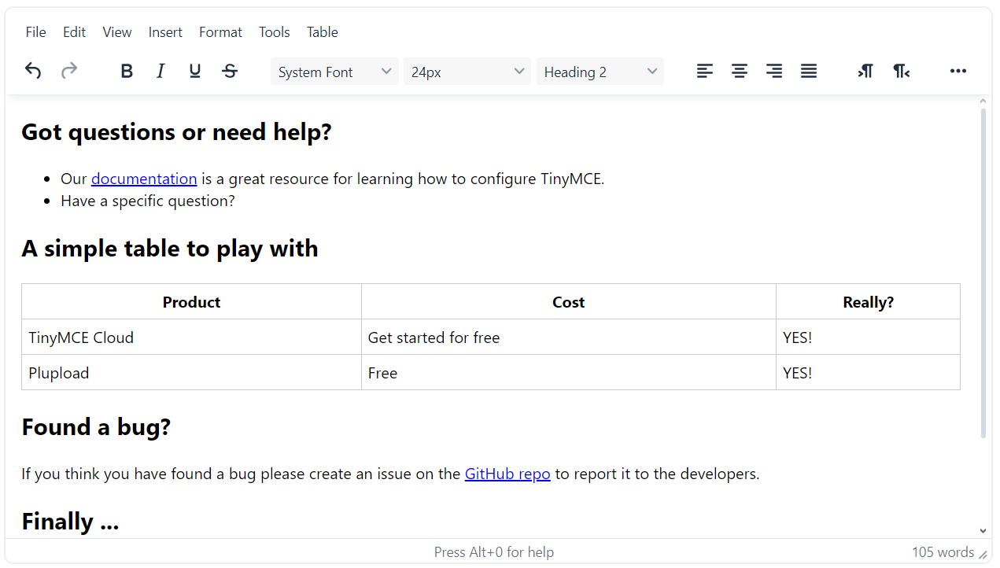

<<<<<<< HEAD
## Sanad Rich text Editor V1.0.0
Sanad tinymce Editor Integratoin.



## Installation
1. `bench get-app https://github.com/champion-sys/snd_tinymce_editor.git`

2. `bench --site sitename install-app snd_tinymce_editor`

## Usage
After installing the application go to `Sanad Editor Settings` Doctype.

**1. Apply On All Default Editors**
<br>
Select this option to change all defult editors to Sanad Editor.

**2. Apply On Specifics Editors**
<br>
Add specific editors to this child table in order to change them to Sanad Editor.
(Select Doctype, Editor Fieldname, Disable/Enable).

**3. Toolbar**
<br>
Add Toolbar items. if left empty toolbar will be disabled.
<br>
- Available options:
feel free to reorder options.
```
undo redo | bold italic underline strikethrough | fontfamily fontsize blocks | alignleft aligncenter alignright alignjustify | ltr rtl | outdent indent | numlist bullist checklist | forecolor backcolor casechange permanentpen formatpainter removeformat | pagebreak | charmap emoticons | fullscreen preview print | insertfile image media pageembed template link anchor codesample | showcomments addcomment | footnotes | mergetags
```

**4. Plugins**
<br>
Add Plugins. if left empty non plugin will be active.
<br>
- Available options:
feel free to reorder options.
```
preview importcss searchreplace autolink directionality code visualblocks visualchars fullscreen image link media codesample table charmap pagebreak nonbreaking anchor insertdatetime advlist lists wordcount help charmap quickbars emoticons accordion
```

**4. Menubar**
<br>
Add Menubar. if left empty menubar will be hidden.
<br>
- Available options:
feel free to reorder options.
```
file edit view insert format tools table help
```

---

=======
# snd_Editor
>>>>>>> 976ae817a430d5d04d18b9553a21b2ce10cfc866
